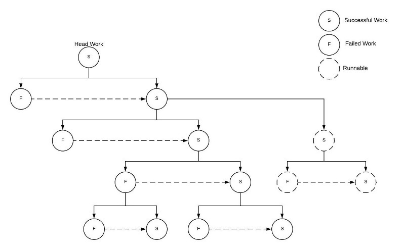

# Work Chain
A Small functional approach to abstracting asynchronous operations in an easy scalable way.

## Features
* Provides structure in executing promises / async functions

## Goal
To provide a structure to handle complex async behaviors. As an example you (1)receive a request, then you (2)call an api to enrich the data, but it fails, so you (3)retry, but it still fails, instead you need to (4)reference the database for that data, now you need to use the data from either the api or database to (5)update another service. This becomes challenging to represent in code. This is an attempt to organize your retries, error handlers, and order of events.

## Development
Install deps

    yarn

Compile

    yarn compile

Run

    yarn run dev

## Examples
There are two main components. `Work` type and `Executor`. Executor receives work to execute or an array
of work to be synchronously executed.

Submitting as work
```typescript
import {Executor, Work} from "work-chain";
const executor = new Executor();
const workToExecute : Work = {
    name : "firstFunction",
    retry : 3,
    func : ({foo, bar}) => {
        // do something with foo bar
        return Promise.resolve({baz : 'baz'});
    },
    // value is passed to func as argument
    value : {
        foo : 'foo',
        bar : 'bar'
    },
    error : {
        name : 'firstFunctionErrorHandler',
        func : ({foo, bar, error}) => {
            // is called if firstFunction throws an error.
            // receives original arguments and the error that was thrown
            // will call secondFunction if next is NOT defined in error
            return Promise.resolve({baz : 'baz'}) 
        }
    },
    next : {
        name  : 'secondFunction',
        retry : 1,
        func : ({baz, doz}) => {
            // baz received from firstFunction
            // doz received from work value
            return Promise.resolve({value : {}});
        },
        value : {
            doz : "dox"
        }   
    }
}
const {value} = await executor.submit(workToExecute);
``` 

submitting as work array
```typescript
const errorHandler = (error) => {
    // do something with error
}
const valueToPass = {
    foo : 'foo'
}

const firstWork = ({valueToPass}) => ({
    name  : "firstWork",
    retry : 5,
    func  : valueToPass => myFunction(valueToPass),
    value : valueToPass,
    error : {
        name : "firstWorkErrorHandler",
        func : errorHandler
    }
});

const secondWork = {
    name : 'secondWork',
    func : returnOfFirstWork => myOtherFunction(returnOfFirstWork),
    retry : 3,
    retryDelay : x => x * 500,
    error : {
        name : "secondWorkErrorHandler",
        func : errorHandler
    }
}
const workSequence = [
    firstWork({valueToPass}),
    secondWork
]
const returnOfLastWork = await executor.submit(workSequence);
```

## Errors
All errors thrown will trigger defined number of retries for work.
After all retries are exahausted the defined error hander `Work` will be called and passed
the original agruments along with the throw error.

`NoRetryError`
Error type thrown to ignore retries.
```Typescript
import {Executor, Work, NoRetryError} from "work-chain";
const executor = new Executor();
const noRetryWork : Work = {
    name : 'noRetryWork',
    func : (params) => {
        const {id} = parms;
        // call api, returns 401
        throw new NoRetryError('received unauthorized response');
    },
    retry : 3, // retries not attempted
    retryDelay : x => x * 500,
    error : {
        name : "secondWorkErrorHandler",
        func : params => {
            const {id, error} = params;
            // refresh api key
            // ...
        }   
    }
}
const result = await executor.submit(noRetryWork);
```


## Work
| attribute     |    type     |   default  | required     |Description
| ----------    | ----------- | -----------| -----------  | ----------- |
| name          |   string    | none       |   true       | title for logging(if enabled)|
| func          |   Function  | none       |   true       | function to execute, will received both current work value and output of previous work|
| error         |   Work      | none       |   false      | function that will be called if `func` throws an error. will receive original arguments and the thrown error|
| next          |   Work      | none       |   false      | The next `Work` to be executed|
| tasks         | Array<Work> | none       |   false      | Collection of `Work` to be executed. will receive output of `func`. Executed in parallel with`next` (if defined)
| retry         |   number    | 0          |   false      | Number to retry executing `func` before calling `error` (if defined)|   
| id            |   string    | uuid       |   false      | an ID to include in logs (if enabled)|
| initialDelay  |   number    | none       |   false      | waits for defined time in mills before executing will not apply to retries |
| retryDelay    |   Function  | none       |   false      | an function that will receive the number of previous attempts as an argument. Should return a number that will be used as a timeout in mills before the next retry.| 

## Flow

